# Markdown 流程图绘制详解

## 一、前言

Markdown 的原生语法不支持绘制图形，但通过 Mermaid 扩展，我们可以将一些格式化的文字渲染成我们需要的图形。常用的图形有 “流程图”、“时序图”、“类图”、“状态图”、“甘特图”、“饼图” 等。

Mermaid 是一个方便于 Markdown 文档撰写者通过文本方式生成图形的扩展工具。相比 Visio 它要轻很多，几行文字便可生成一幅完整且美观的流程图。

本节将重点介绍如何通过 Mermaid 绘制「流程图」。

流程图（flow chart）是体现封闭系统运动状态的有效展示形式，可以让管理者、实现者清晰的认识系统运转流程，也可以直观的描述工作过程。

## 二、基本语法

基本的流程图包含：流程图布局方向、几何图形和连接线三个部分组成。以下是一个简单的Markdown流程图示例，采用Mermaid语法：

````
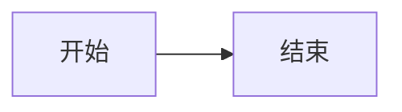
````

**效果如下**：


**说明：**

- `graph LR;`：指定这是一个有向图。
- 节点以及节点之间的关系通过`-->`来表示。
- 方框中的文字表示节点的名称，例如`A[开始]`表示开始节点。
- `决策`节点后接两条分支线，分别表示决策的两个选项。
- 流程图的开始和结束通过特殊节点`开始`和`结束`表示。

### 2.1 流程方向

| 符号/术语         | 含义                                |
| ----------------- | ----------------------------------- |
| TB /TD (两者相同) | 从上到下（Top to Bottom）的流程方向 |
| BT                | 从下到上（Bottom to Top）的流程方向 |
| LR                | 从左到右（Left to Right）的流程方向 |
| RL                | 从右到左（Right to Left）的流程方向 |
| HZ                | 水平方向（Horizontal）的流程方向    |
| VT                | 垂直方向（Vertical）的流程方向      |

### 2.2 定义元素

| 元素类型    | 代表意义   | 形状       |
| ----------- | ---------- | ---------- |
| start       | 开始       | 圆角矩形   |
| end         | 结束/完成  | 圆角矩形   |
| operation   | 流程操作   | 普通矩形   |
| subroutine  | 预定子流程 | 双边线矩形 |
| condition   | 条件判断   | 菱形       |
| inputoutput | 输入输出   | 平行四边形 |

## 三、连接线的种类

不同种类的连接线可以表示不同类型的关系，例如，无方向的连接线可用来表示相关性、有方向的连接线可以表示数据流向或者节点间的依赖关系；用实线表示强关联、用虚线表示弱关联等待。

### 3.1 连接线的形状

**线的形状**
**箭头形状**
**双向箭头**
**语法示例**

````
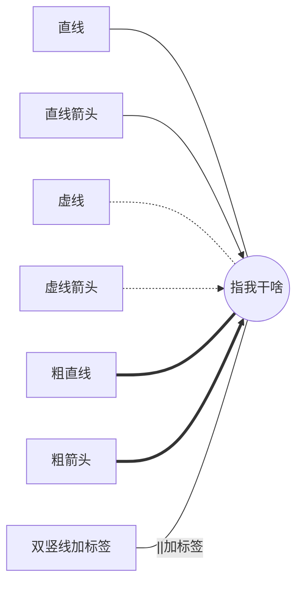
````

**效果如下：**


对于点或粗链接，要添加的字符是等号或点，如下表所示：

| 长度     | 1 个   | 2       | 3        |
| -------- | ------ | ------- | -------- |
| 无向     | `---`  | `----`  | `-----`  |
| 普通箭头 | `-->`  | `--->`  | `---->`  |
| 加粗     | `===`  | `====`  | `=====`  |
| 加粗箭头 | `==>`  | `===>`  | `====>`  |
| 点状     | `-.-`  | `-..-`  | `-...-`  |
| 点状箭头 | `-.->` | `-..->` | `-...->` |

### 3.2 新箭头类型

以下是支持的新类型的箭头：

````
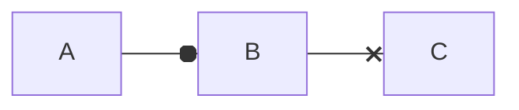
````


多方向箭头：

````
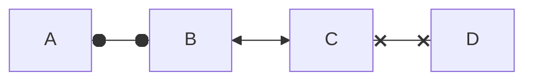
````


### 3.3 带文字连接线

带文字连接线可以在连接线上增加连接线的注释。注释有两种写法：

写在末尾：`||`符号，只需要在连接线符号末尾增加`—>|`文字|即可展示。

写在中间：类似`—文字—>`、`-. 文字 .->`，等于是重复连接符号，前半部分是定义上一个图形到文字的连接线样式，后半部分是定义文字到图形的连接线样式。

| 介绍                 | 语法           |
| -------------------- | -------------- |
| 不带描述文字         | `A--描述---B`  |
| 带描述的箭头         | `A--描述-->B`  |
| 带描述的虚线连指向   | `A-.描述.->B`  |
| 带描述的加粗箭头指向 | `A==描述==>B`  |
| 末尾增加文字         | `A--->|描述|B` |

### 3.4 连接线样式

可以对连接线进行样式设置。例如，您可能希望对流程中倒退的连接线进行样式设置。因为连接不像节点那样可以设置 id，所以需要其他确定连接应附加到哪种样式的方法。

**语法示例**

````
**连接线样式** 在 linkStyle 语句中定义的样式
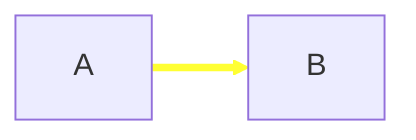


**节点样式** 可以为节点定义指定的样式，例如更粗的边框或不同的背景色：
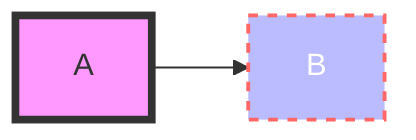

**类 Class** 比每次定义样式更方便的是定义一个样式 class，并将该 class 添加到不同的节点上。
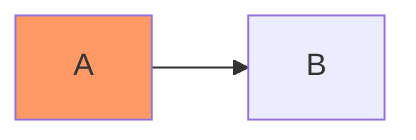
````

**效果如下：**

**连接线样式** 在 linkStyle 语句中定义的样式


**节点样式** 可以为节点定义指定的样式，例如更粗的边框或不同的背景色：


**类 Class** 比每次定义样式更方便的是定义一个样式 class，并将该 class 添加到不同的节点上。


### 3.5 交互语法

可以在节点上定义点击时跳转到超链接。

**语法示例**

````
**跳转链接交换** 超链接在同一浏览器选项卡/窗口中打开。可以通过在 click 定义中添加链接目标来更改此设置 （支持 _self，_blank，_parent 和 _top）：
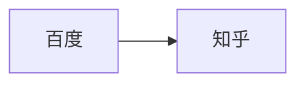
````

**效果如下：**

**跳转链接交换** 超链接在同一浏览器选项卡/窗口中打开。可以通过在 click 定义中添加链接目标来更改此设置 （支持 _self，_blank，_parent 和 _top）：

### 3.6 串联连接

在Mermaid中，可以使用一行代码声明多个连接或节点之间的关系，这使得描述依赖关系变得非常简洁。以下是一些示例：

**语法示例**

````
1. **多个连接关系：**

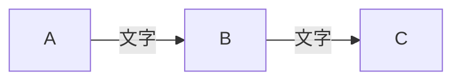

2. **多个节点连接：**

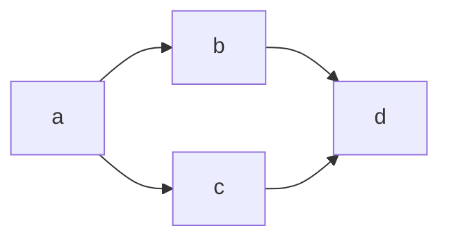

3. **简洁的依赖关系声明：**

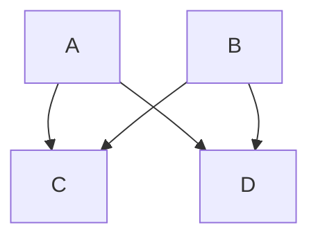
````

**效果如下：**

1. **多个连接关系：**


2. **多个节点连接：**

```mermaid
flowchart LR
   a --> b & c--> d
```

3. **简洁的依赖关系声明：**

```mermaid
flowchart TB
    A & B--> C & D
```


这种简洁的语法提供了更清晰的流程图表示方式。然而，请注意，过于紧凑的表示方式可能会降低Markdown的可读性。在选择使用这种语法时，请确保图表仍然易于理解。

**基本语法等价表示**

虽然一行代码可以表示多个连接关系，但是等价的基本语法会更加详细。以下是等价的基本语法表示：

**语法示例**

````
```mermaid
flowchart TB
    A --> C
    A --> D
    B --> C
    B --> D
```
````

**效果如下：**

```mermaid
flowchart TB
    A --> C
    A --> D
    B --> C
    B --> D
```

这四行代码与前述一行代码具有相同的效果。在选择使用哪种语法时，请根据图表的复杂性和可读性做出明智的决策。

### 3.7 视图分组

mermaid支持将图的一部分包裹起来，形成子图，效果如下：
**语法示例**

````
**子图**
```mermaid 
flowchart LR;
	subgraph 第一个子图
	测试数据1 --> 指我干啥
	end

	subgraph 第二个子图
	测试数据2 --> 你也指我干啥
	end
```

**多子图流转**
在多个子图中，可以在子图之间设置连接线，如下面的例子所示：
```mermaid 
flowchart TB
    c1-->a2
    subgraph A
    a1-->a2
    end
    subgraph B
    b1-->b2
    end
    subgraph C
    c1-->c2
    end
    A --> B
    C --> B
    B --> c2
```

**子图的方向**
在多个流程图中，您可以使用方向语句来设置子图将呈现的方向，就像下面的例子所示：
```mermaid
flowchart LR
  subgraph TOP
    direction TB
    subgraph B1
        direction RL
        i1 -->f1
    end
    subgraph B2
        direction BT
        i2 -->f2
    end
  end
  A --> TOP --> B
  B1 --> B2
```
````

**效果如下**
**子图**

```mermaid 
flowchart LR;
	subgraph 第一个子图
	测试数据1 --> 指我干啥
	end

	subgraph 第二个子图
	测试数据2 --> 你也指我干啥
	end
```

**多子图流转**
在多个子图中，可以在子图之间设置连接线，如下面的例子所示：

```mermaid 
flowchart TB
    c1-->a2
    subgraph A
    a1-->a2
    end
    subgraph B
    b1-->b2
    end
    subgraph C
    c1-->c2
    end
    A --> B
    C --> B
    B --> c2
```

**子图的方向**
在多个流程图中，您可以使用方向语句来设置子图将呈现的方向，就像下面的例子所示：

```mermaid
flowchart LR
  subgraph TOP
    direction TB
    subgraph B1
        direction RL
        i1 -->f1
    end
    subgraph B2
        direction BT
        i2 -->f2
    end
  end
  A --> TOP --> B
  B1 --> B2
```

### 3.8 使用场景及实例

流程图常用于项目的[需求分析](https://edu.csdn.net/cloud/sd_summit?utm_source=glcblog&spm=1001.2101.3001.7020)和设计阶段，也较常出现于程序使用手册中。

**多组合流程**

**语法示例**

````
```mermaid
flowchat
	st=>start: Start :>https://amwiki.xf09.net[blank]
	e=>end: End :>https://amwiki.xf09.net[blank]
	op1=>operation: My Operation
	op2=>operation: Stuff
	sub1=>subroutine: My Subroutine
	cond=>condition: Yes or No? :>https://amwiki.xf09.net[blank]
	c2=>condition: Good idea
	io=>inputoutput: catch something...

	st->op1(right)->cond
	cond(yes, right)->c2
	cond(no)->sub1(left)->op1
	c2(yes)->io->e
	c2(no)->op2->e
```
````

**闰年判断逻辑**

**语法示例**

````
```mermaid
flowchat
	st=>start: Start
	i=>inputoutput: 输入年份n
	cond1=>condition: n能否被4整除？
	cond2=>condition: n能否被100整除？
	cond3=>condition: n能否被400整除？
	o1=>inputoutput: 输出非闰年
	o2=>inputoutput: 输出非闰年
	o3=>inputoutput: 输出闰年
	o4=>inputoutput: 输出闰年
e=>end
	st->i->cond1
	cond1(no)->o1->e
	cond1(yes)->cond2
	cond2(no)->o3->e
	cond2(yes)->cond3
	cond3(yes)->o2->e
	cond3(no)->o4->e
```
````

**冒泡排序流程图**

**语法示例**

````
```mermaid 
flowchart LR
	执行1[i = 1]
	执行2[j = 0]
	执行3[i ++]
	 执行4["a = arr[j], b = arr[j + 1]"]
	 执行5[交换 a, b]
	 执行6[j ++]
	 	判断1["i < n"]
	 	判断2["j < n - i"]
	 判断3["a > b"]
	 开始 --> 执行1
 	 执行1 --> 判断1
  	 判断1 --Y--> 执行2
  	 执行2 --> 判断2
  	 判断2 --Y--> 执行4
  	 判断2 --N--> 执行3
  	 执行3 --> 判断1
  	 执行4 --> 判断3
  	 判断3 --N--> 判断2
  	 判断3 --Y--> 执行5
  	 执行5 --> 执行6
  	 执行6 --> 判断2
  	 判断1 --N--> 结束
```
````

**效果如下**

```mermaid 
flowchart LR
	执行1[i = 1]
	执行2[j = 0]
	执行3[i ++]
	 执行4["a = arr[j], b = arr[j + 1]"]
	 执行5[交换 a, b]
	 执行6[j ++]
	 	判断1["i < n"]
	 	判断2["j < n - i"]
	 判断3["a > b"]
	 开始 --> 执行1
 	 执行1 --> 判断1
  	 判断1 --Y--> 执行2
  	 执行2 --> 判断2
  	 判断2 --Y--> 执行4
  	 判断2 --N--> 执行3
  	 执行3 --> 判断1
  	 执行4 --> 判断3
  	 判断3 --N--> 判断2
  	 判断3 --Y--> 执行5
  	 执行5 --> 执行6
  	 执行6 --> 判断2
  	 判断1 --N--> 结束
```


## 四、节点的形状

### 4.1. 节点的语法

在 Mermaid 中可以使用一些基本符号定义节点的形状，例如：圆角形、跑道形、气缸形、非对称形状、菱形、六角形、平行四边形、梯形。

**语法示例**

````
```mermaid 
flowchart TB;
	A(圆角形节点)
	B[矩形节点]
	C((圆形节点))
	D[(圆柱形节点)]
	E{菱形节点}
```

```mermaid 
flowchart TB;
	F([跑道形节点])
	G{{六角形节点}}
	H[[子程序形状]]
	I>非对称形节点]
```

```mermaid 
flowchart TB;
	J[/梯形--正向\]
	K[\梯形--反向/]
	L[/平行四边形--右倾/]
	M[\平行四边形--左倾\]
```
````

**效果如下：**

```mermaid 
flowchart TB;
	A(圆角形节点)
	B[矩形节点]
	C((圆形节点))
	D[(圆柱形节点)]
	E{菱形节点}
```

```mermaid 
flowchart TB;
	F([跑道形节点])
	G{{六角形节点}}
	H[[子程序形状]]
	I>非对称形节点]
```

```mermaid 
flowchart TB;
	J[/梯形--正向\]
	K[\梯形--反向/]
	L[/平行四边形--右倾/]
	M[\平行四边形--左倾\]
```

### 4.2. 形状图形表


### 4.3 形状介绍

在Mermaid图表中，你可以使用不同的Markdown节点形状来呈现各种元素。以下是一些常见的Markdown节点形状及其用途的简单**介绍**：

| 名称               | 代码                         | 用法                                                 |
| ------------------ | ---------------------------- | ---------------------------------------------------- |
| 圆角形             | 节点ID(round edge)           | 表示起点、终点或注重循环的元素。                     |
| 跑道形             | 节点ID([straight path])      | 用于表示直线路径或流程中的步骤。                     |
| 圆柱形             | 节点ID[(cylinder)]           | 通常用于表示过程或操作，也可以用于表示立体感的元素。 |
| 菱形               | 节点ID{diamond}              | 用于表示判断或决策的节点。                           |
| 圆形               | 节点ID((circle))             | 用于表示起点、终点或注重循环的元素。                 |
| 六角形             | 节点ID{{hexagon}}            | 用于表示起点、终点或注重循环的元素。                 |
| 非对称形           | 节点ID>asymmetric]           | 用于表示不对称的元素。                               |
| 梯形（正向）       | 节点ID[/trapezoid]           | 用于表示正向梯形形状的节点。                         |
| 梯形（反向）       | 节点ID[\reversed trapezoid/] | 用于表示反向梯形形状的节点。                         |
| 平行四边形（右倾） | 节点ID[/parallelogram/]      | 用于表示右倾的平行四边形。                           |
| 平行四边形（左倾） | 节点ID[\parallelogram]       | 用于表示左倾的平行四边形。                           |
| 子程序形状         | 节点ID[[subroutine shape]]   | 用于表示子程序形状的节点。                           |

这些节点形状可以根据需要组合使用，以创建具有更多细节和表达力的Mermaid图表。

## 五. 其他

### 5.1 注解

可以在流程图中输入注释，解析器将忽略该注释。注释需要在独立的行内，并且必须以 %% 开头。注释开始到下一个换行符之后的任何文本都将被视为注释，包括任何流程图语法：

**语法示例**

````
**注释** %%号为注释符，会将符号之后到此行结束都视为注释。
```mermaid
flowchart LR
%% this is a comment A -- text --> B{node}
   A -- text --> B -- text2 --> C
```
````

**效果如下：**

```mermaid
flowchart LR
%% this is a comment A -- text --> B{node}
   A -- text --> B -- text2 --> C
```

### 5.2 转义字符

可以使用下述示例的语法转义字符：

**语法示例**

````
```mermaid
flowchart LR
    A["一个双引号:#quot;"] -->B["一个十进制数字表示的符号:#9829;"]
```
````

数字为十进制，因此 # 符号可以编码为 #35;。此外，也支持使用 HTML 字符名称。

**效果如下：**

```mermaid
flowchart LR
    A["一个双引号:#quot;"] -->B["一个十进制数字表示的符号:#9829;"]
```

## 五. 总结

> - Mermaid 为 Markdown 提供了文本转换为图形的扩展功能；
> - Mermaid 方式渲染的流程图包含布局方向、图形节点和连接线三个基本要素；
> - Mermaid 流程图支持多种节点形状、连接线种类，可以使流程图具有丰富的表现力。